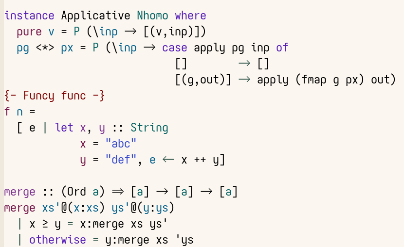

#+title: haskell-ts-mode

[[https://github.com/dschrempf/haskell-ts-mode/actions/workflows/ci.yml][https://github.com/dschrempf/haskell-ts-mode/actions/workflows/ci.yml/badge.svg]]

*NOTICE:* This is a fork of [[https://codeberg.org/pranshu/haskell-ts-mode][Pranshu's =haskell-ts-mode=]] and under active
development. The API may change without notice.

An Emacs major mode for [[https://www.haskell.org/][Haskell]] built on [[https://tree-sitter.github.io/tree-sitter/][Tree-sitter]]. Font lock, structural
and prose navigation, =imenu= and the REPL integration all work off the syntax
tree, which Emacs's built-in =treesit= keeps up to date.

The queries and the prose navigation are written against the node types of
[[https://github.com/dschrempf/tree-sitter-haskell][my fork of the =tree-sitter-haskell= grammar]], which this mode requires; the
official grammar does not work. Building it is a manual step, see
[[#grammar][Installing the grammar]].

#+caption: =haskell-ts-mode= with =prettify-symbols-mode= enabled

* Features
:PROPERTIES:
:CUSTOM_ID: features
:END:

- Font lock at four levels of detail. Because it follows the syntax tree, only
  variables that are actually bound are highlighted -- not every occurrence of
  a name.
- Structural navigation over declarations, bindings and expressions; see
  [[#usage][Usage]].
- Comment-aware editing: sentence and paragraph motion inside =--= and Haddock
  comments, paragraph text objects that stop at the comment/code boundary, and
  marker continuation on =RET=.
- Imenu outline of functions, type signatures, data declarations and type
  aliases.
- A GHCi REPL that uses =cabal repl= inside a cabal project; see [[#repl][REPL]].
- =prettify-symbols-mode= support and an =M-x align= rule for =​=​= signs.

Deliberately out of scope:

- *Indentation.* No indentation rules are installed, so =TAB= keeps Emacs's
  default behaviour (=indent-relative=). Earlier versions shipped Tree-sitter
  indentation rules; they proved unmaintainable and were removed, see
  [[./CHANGELOG.org][CHANGELOG.org]].
- *Completion, diagnostics and cross references.* Use a language server, see
  [[#language-server][Language server]].
- *Formatting.* Use a formatter such as Ormolu, for example through
  [[https://github.com/radian-software/apheleia][Apheleia]].

* Requirements
:PROPERTIES:
:CUSTOM_ID: requirements
:END:

- Emacs 30.1 or newer, built with Tree-sitter support (=treesit-available-p=
  returns non-nil).
- [[https://github.com/purcell/inheritenv][=inheritenv=]], available from MELPA. The REPL needs it when
  =process-environment= / =exec-path= are set buffer-locally rather than
  globally, as a =direnv= integration like [[https://github.com/purcell/envrc][=envrc=]] does: neither the GHCi
  buffer nor the temporary buffer probing =cabal repl= inherits a buffer-local
  value.
- A Haskell grammar built from [[https://github.com/dschrempf/tree-sitter-haskell][my fork]], see [[#grammar][Installing the grammar]].

* Installation
:PROPERTIES:
:CUSTOM_ID: installation
:END:

This fork is not on any package archive; install it from its repository. Add
this into your init.el:

#+begin_src emacs-lisp
(use-package haskell-ts-mode
  :vc (:url "https://github.com/dschrempf/haskell-ts-mode" :rev :newest)
  :custom
  (haskell-ts-font-lock-level 4)
  (haskell-ts-ghci "ghci"))
#+end_src

Dropping =:rev :newest= installs the last release tag instead of the latest
commit. Note that =:ensure t= would install [[https://codeberg.org/pranshu/haskell-ts-mode][Pranshu's =haskell-ts-mode=]] from
MELPA, not this fork.

** Installing the grammar
:PROPERTIES:
:CUSTOM_ID: grammar
:END:

The Haskell Tree-sitter grammar landscape is fragmented. There are several
versions:

- the official [[https://github.com/tree-sitter/tree-sitter-haskell][tree-sitter/tree-sitter-haskell]] grammar (unmaintained);
- a community fork (somewhat maintained);
- a [[https://github.com/tek/tree-sitter-haskell][fork by @tek]] (well maintained);
- [[https://github.com/dschrempf/tree-sitter-haskell][my fork of @tek's grammar]] (well maintained, with some features not in @tek's).

=haskell-ts-mode= requires my fork. @tek's grammar already fixes node type
names that the official grammar gets wrong (=type_synomym= → =type_synonym=,
for example), so the official grammar does *not* work with this mode. On top of
that, mine splits =comment= and =haddock= nodes into a =marker= child (=--=,
=-- |=, =-- ^=, ={-=, ...) and a =content= child holding the body, which prose
navigation reads directly instead of guessing the marker's shape with a
regexp.

The grammar has to be installed manually. =M-x
treesit-install-language-grammar= cannot do it: it defaults to the official
repository, and my repository ships neither a generated parser
(=src/parser.c=) nor a release branch, so the parser has to be produced with
=tree-sitter generate= before it can be compiled.

Either build the shared library yourself (clone the repository, run
=tree-sitter generate=, compile =src/parser.c= into a
=libtree-sitter-haskell= shared object and put it on
=treesit-extra-load-path=), or let a package manager build it. The
=flake.nix= in this repository builds the right grammar for development and
for the test suite.

* Usage
:PROPERTIES:
:CUSTOM_ID: usage
:END:

| Key       | Command                            | Action                                                   |
|-----------+------------------------------------+----------------------------------------------------------|
| =C-c C-r= | =haskell-ts-run=                   | Start a REPL (=C-u= to pick the cabal component)         |
| =C-c C-c= | =haskell-ts-compile-region-and-go= | Send the region, or reload with =:r= when none is active |
| =C-c C-l= | =haskell-ts-load-file=             | Save the buffer and =:load= its file                     |
| =C-c C-e= | =haskell-ts-send-line=             | Send the current line, verbatim                          |
| =C-M-x=   | =haskell-ts-send-defun=            | Send the definition at point                             |

Standard Emacs commands that become Haskell-aware in this mode:

- =C-M-f= and =C-M-b= (=forward-sexp=, =backward-sexp=) move over
  declarations, bindings and expressions.
- =M-e= and =M-a= (=forward-sentence=, =backward-sentence=) move by sentence
  inside comments and strings, and by equation in code.
- =M-x imenu= jumps to a definition, =M-x align= lines up =​=​= signs.

** Structural navigation
:PROPERTIES:
:CUSTOM_ID: structural-navigation
:END:

#+begin_src haskell
combs (x:xs) = map (x:) c ++ c
  where c = combs xs
#+end_src

With point right in front of the definition of =combs=, =C-M-f=
(=forward-sexp=) moves to the end of the second line: the equation and its
=where= clause are one sexp.

** Comments and prose
:PROPERTIES:
:CUSTOM_ID: comments
:END:

A =--= or Haddock comment spanning several lines is a single syntax node whose
continuation markers are ordinary text. Prose motion accounts for that:
sentence and paragraph boundaries are found as if the markers were not there,
and killing a sentence that spans a continuation line leaves that line's
marker in place, rather than merging two comment lines into one.

=RET= inside an own-line comment continues it with the same marker and
indentation. An inline comment -- one that follows code on the same line --
is left alone.

With =evil= loaded, the paragraph text objects (=a p=, =i p=) and sentence
deletion (=d a s=) stay inside the comment instead of spilling into the
surrounding code, even when the comment is glued directly to it.

* REPL
:PROPERTIES:
:CUSTOM_ID: repl
:END:

=C-c C-r= (=haskell-ts-run=) starts an inferior Haskell process. When the
current buffer is inside a cabal project (a =cabal.project= or =*.cabal= file
is found by walking up the directory tree), the process is started with =cabal
repl= in the project root, so the project's dependencies, default language
extensions and GHC options are available, and relative =import='s and the
module search path resolve. Outside a cabal project it falls back to plain
=ghci=. This is controlled by =haskell-ts-use-cabal= (default =auto=; set it
to =nil= to always use =ghci=, or =t= to always use =cabal=).

The current file is passed as the cabal target, so the owning component is
opened. When the file belongs to several components, =haskell-ts-run= prompts
for one and remembers the choice per buffer; a prefix argument (=C-u C-c C-r=)
forces the prompt even for an unambiguous file.

=C-M-x= sends the definition at point -- the same definition
=treesit-defun-name-function= and imenu use, so it is either a top-level
binding or, from inside a =where= or =let= block, the enclosing local one.

The inferior buffer runs =haskell-ts-inferior-mode= (derived from
=comint-mode=): the prompt is read-only and input history is persisted across
sessions in =haskell-ts-inferior-history-file=. Filename completion and
history navigation (=TAB=, =M-p=, =M-n=) come from =comint=.

* Customization
:PROPERTIES:
:CUSTOM_ID: customization
:END:

** Font lock level

Set =haskell-ts-font-lock-level= to a value between 1 and 4. The default, 4,
fontifies the most; lower it for a quieter buffer.

** Prettify Symbols mode

=prettify-symbols-mode= replaces common operators with unicode alternatives,
turning =->= into =→=:

#+begin_src emacs-lisp
(add-hook 'haskell-ts-mode-hook 'prettify-symbols-mode)
#+end_src

Set =haskell-ts-prettify-words= to non-nil to prettify words as well, turning
=forall= into =∀= and =elem= into =∈=.

** Aligning =​=​= signs

Calling =M-x align= on a region lines up the standalone =​=​= signs of the
bindings and equations it contains, for example:

#+begin_example
x   = 1
foo = 2
ab  = 3
#+end_example

Only an =​=​= surrounded by whitespace is aligned, so =​==​=, =​=>​=,
=​<=​=, =​>=​= and =​/=​= are left untouched. The rule lives in
=haskell-ts-align-rules-list=.

** Language server
:PROPERTIES:
:CUSTOM_ID: language-server
:END:

=haskell-ts-mode= declares =haskell-mode= as a parent mode, so configuration
keyed on =haskell-mode= applies to it. =eglot= therefore picks up
=haskell-language-server-wrapper= without further setup, and =lsp-mode= works
as well.

** Other recommended packages

Unlike =haskell-mode=, this mode has limited scope. Other packages that help a
lot with development:

- [[https://codeberg.org/rahguzar/consult-hoogle][consult-hoogle]] to consult Hoogle.
- [[https://github.com/radian-software/apheleia][Apheleia]] to format code.

* Comparison with =haskell-mode=
:PROPERTIES:
:CUSTOM_ID: comparison
:END:

=haskell-mode= is about 30 years old and has grown to nearly 30,000 lines
covering all things Haskell related. Much of what it once provided is now part
of standard Emacs. In 2018, [[https://elpa.nongnu.org/nongnu/haskell-tng-mode.html][=haskell-tng-mode=]] set out to solve some of
these problems, but because of Haskell's syntax it too became complex and
required a web of dependencies. Both modes end up practically parsing Haskell
in order to indent it -- so why not use a parser?

Compared with =haskell-mode=, this mode:

- highlights logically rather than approximately:
  - only arguments that can be used in the function body are highlighted; in
    =f (_:(a:[]))= that is =a= alone, as it is the only captured variable;
  - the return type of a function is highlighted;
  - newly bound variables are highlighted wherever they appear, including
    generators and lambda arguments;
  - the =​=​= of a guarded match is recognized as such, which would be
    stupidly hard with regular expressions;
- is more performant, especially on long files;
- is much, much smaller: it keeps to basic major mode functionality and leaves
  other tasks to external packages.

* Contributing
:PROPERTIES:
:CUSTOM_ID: contributing
:END:

Issues and pull requests are welcome. In the flake's development shell (=nix
develop=), =make check= byte-compiles the sources and runs the formatting
check, =checkdoc=, =package-lint= and the ERT suite; =nix flake check= runs the
same gate in a sandbox. Outside the development shell the tests that need the
Tree-sitter grammar are skipped rather than failed.

* Changelog

See [[./CHANGELOG.org][CHANGELOG.org]] for the list of notable changes.

* License

GPL-3.0-or-later, see [[./LICENSE][LICENSE]].
